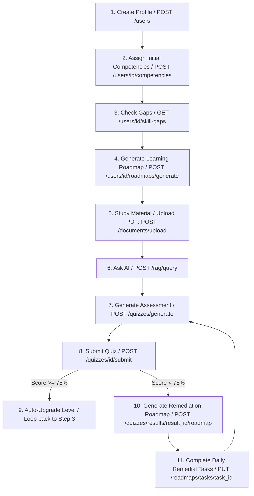

# API Documentation for Frontend Integration

Welcome to the API documentation for the **AI-Enabled Skill Intelligence & Learning Platform**. This document details all available REST endpoints to help frontend developers integrate with the backend.

The base URL for all endpoints is:
```text
http://localhost:8000/api/v1
```

---

## 🧭 Frontend End-to-End User Flow

To implement the core experience, follow this step-by-step API integration sequence:



### Detailed Sequence
1. **User Onboarding**:
   - Call `POST /users` to register the official. Store the returned `user_id`.
   - Seed initial competency levels by calling `POST /users/{user_id}/competencies` for key statistical or technical skills.

2. **Dashboard Load & Skill Pathways**:
   - Fetch skill gaps using `GET /users/{user_id}/skill-gaps` to render priority progress bars (e.g., Python gap = 3, High priority).
   - Fetch recommended courses via `GET /users/{user_id}/recommendations` to render general course cards.
   - **Personalized Day-by-Day Roadmap**: Allow users to click "Generate Roadmap" for a targeted skill (like Python). Call `POST /users/{user_id}/roadmaps/generate` to build a day-by-day learning task checklist. Toggle daily checklist tasks via `PUT /roadmaps/tasks/{task_id}` to update overall roadmap progress percentage.

3. **Active Learning (AI Assistant)**:
   - Allow trainers to upload study PDFs/handouts via `POST /documents/upload` (returns a `document_id`).
   - Render a chat UI where the student queries the AI tutor using `POST /rag/query` with the specified `document_id`.

4. **Assessment & Remediation Loop**:
   - Click "Take Quiz" which calls `POST /quizzes/generate` for the document context.
   - Render the generated MCQs (excluding correct options from GET schemas).
   - Post responses to `POST /quizzes/{quiz_id}/submit?user_id={user_id}`.
   - **Scenario A (Pass - Score $\ge$ 75%)**: The backend automatically increments their competency `current_level` by 1. Refresh the Dashboard (Step 2) to display the newly adjusted skill gaps and updated recommendations.
   - **Scenario B (Fail - Score $<$ 75%)**: The submission response returns a `result_id`. Render a "Generate Remedial Plan" button. Call `POST /quizzes/results/{result_id}/roadmap?number_of_days=3` to construct a day-by-day revision roadmap focusing *only* on the questions and topics the user answered incorrectly. Complete these revision tasks via `PUT /roadmaps/tasks/{task_id}` to prepare for a re-assessment.

---

## 1. User Management

### **Create User Profile**
* **Endpoint:** `POST /users`
* **Description:** Registers a new learner profile in the system.
* **Request Body:**
  ```json
  {
    "name": "Rahul Sharma",
    "email": "rahul@example.gov.in",
    "department": "Department of Statistics",
    "designation": "Statistical Officer",
    "job_role": "Survey Analyst",
    "experience_years": 5,
    "education": "M.Sc Statistics",
    "career_goal": "AI and Machine Learning Specialist"
  }
  ```
* **Response (201 Created):**
  ```json
  {
    "id": 1,
    "name": "Rahul Sharma",
    "email": "rahul@example.gov.in",
    "department": "Department of Statistics",
    "designation": "Statistical Officer",
    "job_role": "Survey Analyst",
    "experience_years": 5,
    "education": "M.Sc Statistics",
    "career_goal": "AI and Machine Learning Specialist",
    "competencies": []
  }
  ```

---

### **Get User Profile**
* **Endpoint:** `GET /users/{user_id}`
* **Description:** Retrieves the user details along with their current competency metrics.
* **Response (200 OK):**
  ```json
  {
    "id": 1,
    "name": "Rahul Sharma",
    "email": "rahul@example.gov.in",
    "department": "Department of Statistics",
    "designation": "Statistical Officer",
    "job_role": "Survey Analyst",
    "experience_years": 5,
    "education": "M.Sc Statistics",
    "career_goal": "AI and Machine Learning Specialist",
    "competencies": [
      {
        "competency_id": 6,
        "current_level": 2,
        "required_level": 5,
        "id": 1,
        "user_id": 1,
        "competency_name": "Python",
        "category": "Technical",
        "last_updated": "2026-08-30T12:00:00"
      }
    ]
  }
  ```

---

### **Update User Profile**
* **Endpoint:** `PUT /users/{user_id}`
* **Description:** Updates details on an existing user profile.
* **Request Body:** (Any subset of fields can be supplied)
  ```json
  {
    "career_goal": "Data Science Lead"
  }
  ```
* **Response (200 OK):**
  ```json
  {
    "id": 1,
    "name": "Rahul Sharma",
    "email": "rahul@example.gov.in",
    "department": "Department of Statistics",
    "designation": "Statistical Officer",
    "job_role": "Survey Analyst",
    "experience_years": 5,
    "education": "M.Sc Statistics",
    "career_goal": "Data Science Lead",
    "competencies": [...]
  }
  ```

---

## 2. Competencies & Skill Gaps

### **List All System Competencies**
* **Endpoint:** `GET /competencies`
* **Description:** Retrieves the master framework of all skills/competencies (Statistical, Technical, Digital Governance, etc.). Seeding is auto-triggered if the database is fresh.
* **Response (200 OK):**
  ```json
  [
    {
      "id": 1,
      "name": "Survey Design",
      "category": "Statistical",
      "description": "Methodology for planning and designing statistical surveys."
    },
    {
      "id": 6,
      "name": "Python",
      "category": "Technical",
      "description": "General programming for data analysis and software development."
    }
  ]
  ```

---

### **Assign Competency to User**
* **Endpoint:** `POST /users/{user_id}/competencies`
* **Description:** Registers or updates a learner's skill level (on a 0-5 scale) against a specific competency.
* **Request Body:**
  ```json
  {
    "competency_id": 6,
    "current_level": 1,
    "required_level": 4
  }
  ```
* **Response (200 OK):**
  ```json
  {
    "id": 1,
    "user_id": 1,
    "competency_id": 6,
    "competency_name": "Python",
    "category": "Technical",
    "current_level": 1,
    "required_level": 4,
    "last_updated": "2026-08-30T12:03:00"
  }
  ```

---

### **Get User Skill Gaps**
* **Endpoint:** `GET /users/{user_id}/skill-gaps`
* **Description:** Calculates the delta (`Required - Current`) for all user competencies where `Required > Current`.
* **Response (200 OK):**
  ```json
  {
    "user_id": 1,
    "skill_gaps": [
      {
        "competency": "Python",
        "current_level": 1,
        "required_level": 4,
        "gap": 3,
        "priority": "HIGH"
      }
    ]
  }
  ```
* **Priority Mapping Logic:**
  * Gap $\le$ 0 $\rightarrow$ `NONE`
  * Gap = 1 $\rightarrow$ `LOW`
  * Gap = 2 $\rightarrow$ `MEDIUM`
  * Gap = 3 $\rightarrow$ `HIGH`
  * Gap $\ge$ 4 $\rightarrow$ `CRITICAL`

---

## 3. Course Recommendations

### **List All Courses**
* **Endpoint:** `GET /courses`
* **Description:** Gets all registered courses. Supports filtering to narrow down search.
* **Query Parameters (Optional):**
  * `skill`: Filter by skill name (e.g. `?skill=Python`)
  * `level`: Filter by level (`?level=Beginner`)
  * `language`: Filter by language (`?language=English`)
* **Response (200 OK):**
  ```json
  [
    {
      "id": 2,
      "external_id": "IGOT002",
      "source": "iGOT",
      "title": "FastAPI: Building Modern REST APIs in Python",
      "description": "Comprehensive guide to building high-performance APIs...",
      "level": "Intermediate",
      "duration_hours": 12,
      "language": "English",
      "skills": "Python,SQL,APIs"
    }
  ]
  ```

---

### **Get Personalized Recommendations**
* **Endpoint:** `GET /users/{user_id}/recommendations`
* **Description:** Evaluates the user's skill gaps, career goals, job role, and history to output course matches ranked by priority.
* **Response (200 OK):**
  ```json
  [
    {
      "course_id": 2,
      "title": "FastAPI: Building Modern REST APIs in Python",
      "description": "Comprehensive guide to building high-performance APIs...",
      "score": 0.85,
      "skills_addressed": ["Python", "SQL", "APIs"],
      "reason": "Addresses your skill gap in: Python."
    }
  ]
  ```

---

## 4. Learning Materials & RAG

### **Upload Learning Material**
* **Endpoint:** `POST /documents/upload`
* **Description:** Uploads a file for RAG vector parsing. The backend automatically extracts text, chunks it, generates embeddings, and saves it to SQLite.
* **Request Type:** `multipart/form-data`
* **Form Data Parameter:** `file` (Supports `.pdf`, `.docx`, `.pptx`, `.txt`)
* **Response (201 Created):**
  ```json
  {
    "id": 10,
    "filename": "sampling_handout.pdf",
    "file_type": "pdf"
  }
  ```

---

### **AI Tutor Chat Query (RAG)**
* **Endpoint:** `POST /rag/query`
* **Description:** Queries the AI assistant using context retrieved from uploaded documents.
* **Request Body:**
  ```json
  {
    "question": "What is stratified random sampling?",
    "document_id": 10 
  }
  ```
  *(Omit `document_id` to search across all uploaded materials)*
* **Response (200 OK):**
  ```json
  {
    "answer": "Stratified random sampling involves dividing a population into homogeneous subgroups called strata, and then...",
    "sources": [
      {
        "document": "sampling_handout.pdf",
        "page": 4,
        "content_snippet": "Stratified sampling ensures representation of key sub-groups..."
      }
    ]
  }
  ```

---

## 5. Assessments & Quizzes

### **Generate Quiz**
* **Endpoint:** `POST /quizzes/generate`
* **Description:** Prompts ChatGroq to build a structured MCQ assessment dynamically from an uploaded document.
* **Request Body:**
  ```json
  {
    "document_id": 10,
    "topic": "Stratified Sampling",
    "number_of_questions": 5,
    "difficulty": "medium"
  }
  ```
* **Response (201 Created):** *(Note: Correct answers and explanations are omitted from this response for quiz integrity)*
  ```json
  {
    "id": 20,
    "document_id": 10,
    "topic": "Stratified Sampling",
    "difficulty": "medium",
    "questions": [
      {
        "id": 45,
        "question_text": "What is the primary purpose of a stratum in sampling?",
        "options": [
          "To reduce homogeneity",
          "To secure homogeneous subgroups",
          "To sample randomly without criteria",
          "To increase margin of error"
        ],
        "topic": "Stratified Sampling",
        "difficulty": "medium",
        "source_reference": "sampling_handout.pdf, page 4"
      }
    ]
  }
  ```

---

### **Submit Quiz Responses**
* **Endpoint:** `POST /quizzes/{quiz_id}/submit`
* **Description:** Submits the user's responses for grading. Also triggers G7: Bumps up the user's associated competency score by 1 if they pass with $\ge$ 75%.
* **Query Parameters:** `user_id` (e.g. `?user_id=1`)
* **Request Body:**
  ```json
  {
    "answers": {
      "45": "To secure homogeneous subgroups"
    }
  }
  ```
* **Response (200 OK):**
  ```json
  {
    "score": 100.0,
    "total_questions": 1,
    "correct_answers": 1,
    "feedback": "You scored 100%. Excellent! You have mastered this material.",
    "correct_details": {
      "45": {
        "correct": "To secure homogeneous subgroups",
        "explanation": "Strata are specifically selected to be internally homogeneous to lower sampling variance."
      }
    }
  }
  ```

---

## 6. Learning History & Progress

### **Update Course Progress**
* **Endpoint:** `POST /users/{user_id}/progress`
* **Description:** Records or updates progress on recommended courses.
* **Request Body:**
  ```json
  {
    "course_id": 2,
    "status": "In Progress",
    "progress_percentage": 40
  }
  ```
* **Response (200 OK):**
  ```json
  {
    "id": 5,
    "user_id": 1,
    "course_id": 2,
    "status": "In Progress",
    "progress_percentage": 40,
    "last_accessed": "2026-08-30T12:05:00",
    "completed_at": null
  }
  ```

---

### **Get User Progress Records**
* **Endpoint:** `GET /users/{user_id}/progress`
* **Description:** Retrieves the progress log of the user.
* **Response (200 OK):**
  ```json
  [
    {
      "id": 5,
      "user_id": 1,
      "course_id": 2,
      "status": "In Progress",
      "progress_percentage": 40,
      "last_accessed": "2026-08-30T12:05:00",
      "completed_at": null
    }
  ]
  ```

---

## 7. Daily Roadmap Tracker

### **Generate Daily Learning Roadmap**
* **Endpoint:** `POST /users/{user_id}/roadmaps/generate`
* **Description:** Requests ChatGroq to segment a targeted competency gap into a structured, day-by-day learning task roadmap.
* **Request Body:**
  ```json
  {
    "target_competency": "Python",
    "number_of_days": 5
  }
  ```
* **Response (201 Created):**
  ```json
  {
    "id": 1,
    "user_id": 1,
    "title": "Python Mastery Roadmap",
    "target_competency": "Python",
    "progress_percentage": 0,
    "created_at": "2026-08-30T13:28:00",
    "tasks": [
      {
        "id": 1,
        "day_number": 1,
        "task_title": "Setup and Syntax Basics",
        "task_description": "Install python v3.11, write a hello world script, and practice integer operations.",
        "status": "Pending",
        "completed_at": null
      },
      {
        "id": 2,
        "day_number": 2,
        "task_title": "Control Flows",
        "task_description": "Understand if-else statements and write while loops.",
        "status": "Pending",
        "completed_at": null
      }
    ]
  }
  ```

---

### **Get User Roadmaps**
* **Endpoint:** `GET /users/{user_id}/roadmaps`
* **Description:** Retrieves all generated roadmaps for the user.
* **Response (200 OK):**
  ```json
  [
    {
      "id": 1,
      "user_id": 1,
      "title": "Python Mastery Roadmap",
      "target_competency": "Python",
      "progress_percentage": 0,
      "created_at": "2026-08-30T13:28:00",
      "tasks": [...]
    }
  ]
  ```

---

### **Toggle Daily Task Status**
* **Endpoint:** `PUT /roadmaps/tasks/{task_id}`
* **Description:** Toggles the completion status of a daily task. The backend automatically recalculates the parent roadmap's overall `progress_percentage`.
* **Request Body:**
  ```json
  {
    "status": "Completed" 
  }
  ```
  *(Options: "Pending" or "Completed")*
* **Response (200 OK):**
  ```json
  {
    "id": 1,
    "day_number": 1,
    "task_title": "Setup and Syntax Basics",
    "task_description": "Install python v3.11, write a hello world script, and practice integer operations.",
    "status": "Completed",
    "completed_at": "2026-08-30T13:29:15"
  }

---

### **Generate Remediation Roadmap from Quiz Result**
* **Endpoint:** `POST /quizzes/results/{result_id}/roadmap`
* **Description:** Analyzes a failed quiz attempt (`score < 75%`), extracts the questions the user got incorrect, and prompts ChatGroq to build a highly targetedday-by-day study roadmap focusing only on those failed topics.
* **Query Parameters (Optional):**
  * `number_of_days`: Length of remedial course (default is `3`)
* **Response (201 Created):**
  ```json
  {
    "id": 2,
    "user_id": 1,
    "title": "Personalized Remediation Roadmap",
    "target_competency": "Remediation for Quiz",
    "progress_percentage": 0,
    "created_at": "2026-08-30T13:34:00",
    "tasks": [
      {
        "id": 10,
        "day_number": 1,
        "task_title": "Review Simple Random Sampling Gaps",
        "task_description": "Study why simple random sampling gives every element an equal chance, correcting your answer on biased methods.",
        "status": "Pending",
        "completed_at": null
      }
    ]
  }
  ```
