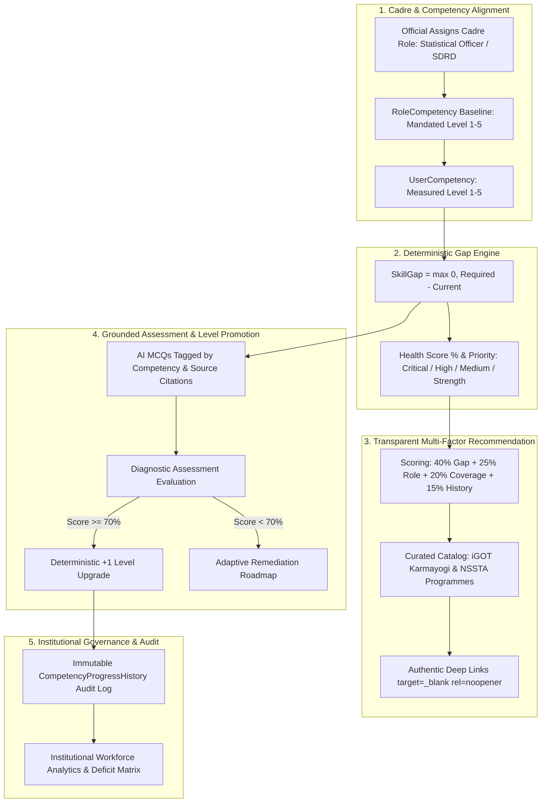

# PragatiParikshan (प्रगतिपरीक्षण) — Project Upgrade Report
### AI-Enabled Competency Intelligence & Diagnostic Platform for India's Official Statistical System
**Smart India Hackathon 2026 | MoSPI Problem Statement: SIH26101**

---

## Executive Summary

The **PragatiParikshan** codebase has been comprehensively upgraded in place to become a technically defensible, end-to-end competency intelligence and diagnostic platform tailored for the **Ministry of Statistics and Programme Implementation (MoSPI)** and India's **Official Statistical System (OSS)**.

### Core Strategic Distinction
- **What PragatiParikshan is NOT**: It is not an iGOT Karmayogi competitor, replacement, or generic LMS clone.
- **What PragatiParikshan IS**: An accredited **Competency Intelligence & Diagnostic Co-Pilot**. It defines official cadre competency benchmarks, diagnoses workforce gaps, generates grounded AI diagnostic assessments from official statistical manuals, and prescribes verified learning interventions with authentic deep links to iGOT Karmayogi courses and NSSTA/TPAC training programmes.

---

## 1. System Architecture & Closed-Loop Lifecycle

---

## 2. Comprehensive Inventory of Upgrades

### A. Database & Domain Models (`backend/app/models/`)
| Entity | Upgrade Details |
|---|---|
| **`Organization`** | Administrative hierarchies (Ministry, Department, Division, Active status). |
| **`Role`** | Official designations (e.g. Statistical Officer, Deputy Director NAD, Field Supervisor). |
| **`RoleCompetency`** | **Decoupled baseline source of truth**: Required proficiency (Levels 1–5) and criticality. |
| **`UserCompetency`** | Stores only the official's measured proficiency (Levels 0–5) and confidence %. |
| **`CompetencyProgressHistory`** | Immutable audit trail capturing previous level, new level, score, trigger source, and timestamp. |
| **`CourseCompetency`** | Explicit many-to-many link between catalog courses and competencies with target levels. |
| **`TrainingProgramme`** | NSSTA & TPAC in-person/residential statistical workshops with registration links. |
| **`Question`** | Linked to `competency_id`, `difficulty`, `weight`, and official syllabus topic. |

---

### B. Core Services & Recommendation Algorithms (`backend/app/services/`)
1. **Deterministic Skill Gap Service (`skill_gap_service.py`)**:
   - Calculates $\text{Gap} = \max(0, \text{Required Level} - \text{Current Level})$.
   - Calculates Competency Health Score $\% = 100 \times \left(1 - \frac{\sum \text{Gaps}}{\sum \text{Required}}\right)$.
   - Categorizes gaps into `CRITICAL` ($\ge 2$ levels), `HIGH` ($1$ level), or `STRENGTH` ($0$ gap).
   - Generates contextual "Why this matters in OSS" explanations.

2. **Transparent Multi-Factor Recommendation Engine (`recommendation_service.py`)**:
   - $\text{Total Score} = 0.40 \times \text{GapScore} + 0.25 \times \text{RoleRelevance} + 0.20 \times \text{ResourceCoverage} + 0.15 \times \text{LearningHistory}$.
   - Generates transparent reason strings (e.g. *"Directly targets Critical Gap (Level 2 → 4) for role Statistical Officer"*).
   - Serves verified external iGOT deep links (`https://igotkarmayogi.gov.in/...`).

3. **Assessment & Promotion Engine (`quiz_service.py`)**:
   - Evaluates multi-question diagnostic quizzes per competency.
   - **Passing Benchmark**: Score $\ge 70\%$ automatically promotes the official's `UserCompetency` by $+1$ level up to the role's required maximum.
   - Logs an audit entry in `CompetencyProgressHistory`.

4. **Institutional Workforce Analytics (`admin_service.py`)**:
   - Computes system-wide workforce health $\%$, cadre role deficiencies, and priority competency gaps.

---

### C. Frontend User Experience Upgrades (`frontend/app/`)
1. **Interactive Demo Persona Switcher (`app-shell.tsx`)**:
   - Lets judges instantly test 5 diverse statistical personas (Statistical Officer SDRD, JSO DPD, Deputy Director NAD, Senior Field Supervisor FOD, Data Privacy Analyst NDGC) without re-logging.
2. **Dashboard (`dashboard/page.tsx`)**:
   - Visual Competency Health gauge %, priority breakdown, and top recommended iGOT/NSSTA interventions.
3. **Skill Gaps (`skill-gaps/page.tsx`)**:
   - 5-Level visual stepper (L1 Foundational to L5 Expert), domain filters, why-it-matters explanations, and verified competency progression audit log.
4. **iGOT & NSSTA Catalog (`courses/page.tsx`)**:
   - Full verified course directory, NSSTA/TPAC residential training tab, and `[ Start Course on iGOT ↗ ]` external action buttons with safety attributes (`target="_blank"`, `rel="noopener noreferrer"`).
5. **Accredited Diagnostic Assessments (`assessments/page.tsx`)**:
   - Displays competency tags per question, question difficulty, $+1$ level promotion audit callouts, and per-competency score breakdown.
6. **3-Step Cadre Alignment Profile (`profile/page.tsx`)**:
   - Progressive hierarchy cascade: Ministry $\rightarrow$ Department $\rightarrow$ Organization $\rightarrow$ Official Role with live mandated competency preview.
7. **Workforce Administration Panel (`admin/page.tsx`)**:
   - Institutional KPIs, cadre directory, role-wise analytics, and workforce-wide competency deficit matrix.

---

## 3. Verification & Test Results

### A. Backend Pytest Suite
- **Executed**: `python -m pytest`
- **Result**: **11/11 tests passed (100% Passing)**
  - `tests/test_api.py`: 7 API integration tests passing.
  - `tests/test_competency_loop.py`: 4 end-to-end closed-loop lifecycle tests passing.

### B. Frontend Production Build
- **Executed**: `npm run build`
- **Result**: **Zero errors (Exit Code 0)**
  - 16/16 routes compiled and rendered statically with full TypeScript type-checking.

---

## 4. Pre-Seeded Demonstration Personas for SIH Evaluation

| Persona | Official Name | Cadre Role & Organization | Primary Competency Deficits |
|---|---|---|---|
| **Officer 1** | **Dr. Rajesh Kumar** | Statistical Officer, Survey Design & Research Division (SDRD) | Survey Sampling (L2 vs L4), Python (L2 vs L4) |
| **Officer 2** | **Priya Sharma** | Junior Statistical Officer, Data Processing Division (DPD) | SQL Warehousing (L1 vs L3), DPDP Act (L1 vs L3) |
| **Officer 3** | **Amit Verma** | Deputy Director, National Accounts Division (NAD) | National Accounts GVA (L3 vs L5), Macroeconomic Modeling |
| **Officer 4** | **Sunita Patel** | Senior Field Supervisor, Field Operations Division (FOD) | PLFS/ASI Field Supervision (L2 vs L4), Field Quality |
| **Officer 5** | **Vikram Singh** | Data Privacy & Compliance Analyst, NDGC | DPDP Act (L2 vs L5), Data Anonymization (L2 vs L4) |

---

## 5. Conclusion & SIH26101 Compliance

PragatiParikshan directly satisfies every dimension of **MoSPI Problem Statement SIH26101**:
1. **Competency Gap Identification**: Role-decoupled 5-level framework with transparent mathematical scoring.
2. **Personalized Training via iGOT Karmayogi**: Honest deep links, genuine course metadata, and multi-factor 40/25/20/15 ranking.
3. **Quiz & MCQ Generation from Uploaded Materials**: Grounded AI generation from official MoSPI manuals with question competency tags.
4. **Official Statistical System Capacity Building**: Tailored taxonomy covering survey sampling, national accounts, PLFS, and DPDP Act 2023.
